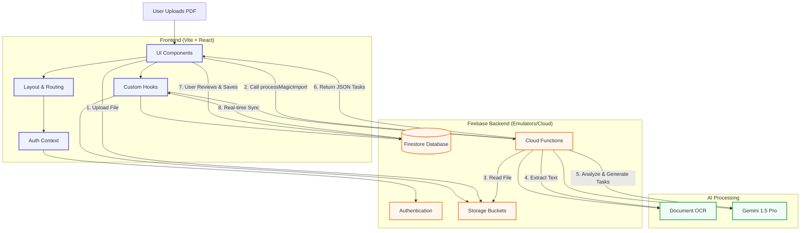

## detailed Layer Breakdown

### 1. Presentation Layer (Frontend)

- **Framework**: React 19 + TypeScript + Vite
- **State Management**:
  - **Auth**: `AuthContext` (User session)
  - **Data**: `useTasks` (Real-time Firestore listeners)
  - **UI**: Local state using `useState` and `useReducer`
- **Styling**: CSS Modules with CSS Variables (`variables.css`) for theming.

### 2. Service Layer (Firebase SDK)

- **Authentication**: Google Sign-In via Firebase Auth.
- **Database**: Firestore queries wrapped in custom hooks.
- **Storage**: Direct upload from client.
- **Functions**: Callable Cloud Functions for complex logic (AI).

### 3. Backend Logic (Cloud Functions)

- **Environment**: Node.js runtime.
- **Triggers**: HTTPS Callable (for direct UI interaction) and Firestore Triggers (for background cleanups).
- **Security**: Admin SDK access, validated input.

### 4. Intelligence Layer (AI)

- **Gemini 1.5 Pro**: Used for understanding context, parsing PDFs/CSVs, and generating structured Task JSON.
- **Document AI (Optional)**: For specialized OCR if needed, though Gemini Multimodal is primary.
