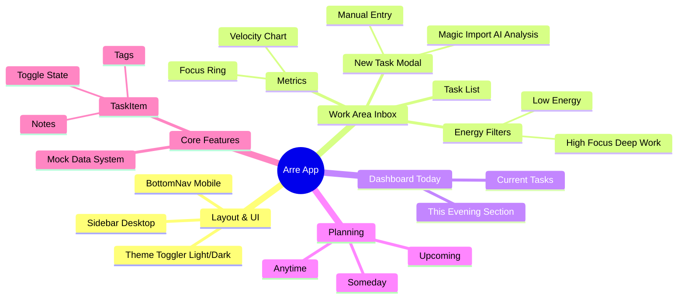

# Arre - High-Performance Productivity App

**Arre** is a modern, minimalist productivity application designed to help you focus on what matters. Inspired by the "White Paper" aesthetic with vibrant, surprising accents, Arre combines sleek design with deep work analytics.


_(Replace with actual screenshot)_

## 🚀 Features

### 🎨 Design & Experience

- **Premium Aesthetic**: Clean "White Paper" look for clarity, matched with a **High-Performance Dark Mode** featuring neon cyan and purple accents.
- **Responsive Layout**: Adaptive design with a collapsible Sidebar for desktop and a native-feel Bottom Navigation for mobile.
- **Theme System**: Robust toggling between Light, Dark, and System preferences.

### ⚡ Work Area (Inbox)

- **Deep Work Dashboard**: A specialized view for your inbox and active work.
- **Productivity Metrics**:
  - **Velocity Chart**: Visualizes your completion rate over the last 7 days.
  - **Daily Focus**: Tracks time spent in deep work with trend indicators.
  - **Task Progress**: Bar charts showing daily throughput.
- **Energy-Based Filtering**: Filter tasks by your current energy level:
  - 🟢 **Low Energy**: For quick wins and administrative tasks.
  - 🟡 **Neutral**: For standard workflow.
  - 🟣 **High Focus**: For "Deep Work" sessions.
- **Magic Import (AI)**:
  - Drag & Drop interface for PDFs and CSVs.
  - Generative AI analysis to extract actionable tasks.
  - One-click import to your task list.

### 📅 Smart Organization

- **Today View**: A focused list of tasks for right now, with a distinct **"This Evening"** section for separating work from personal time.
- **Planning Views**: Dedicated views for **Upcoming**, **Anytime**, and **Someday** to keep your roadmap clear.

## 🛠️ Tech Stack

- **Framework**: React 19 + Vite (TypeScript)
- **Styling**: CSS Modules + CSS Custom Properties (Variables)
- **Icons**: Lucide React
- **Charts**: Recharts
- **Animations**: Framer Motion

## 🧩 Application Structure



## 📦 Installation

1.  **Clone the repository**

    ```bash
    git clone https://github.com/yourusername/arre.git
    cd arre
    ```

2.  **Install dependencies**

    ```bash
    npm install
    ```

3.  **Run the development server**

    ```bash
    npm run dev
    ```

4.  **Build for production**
    ```bash
    npm run build
    ```

## 🔮 Future Roadmap (Pending)

- **Drag & Drop**: Kanban-style organization for Anytime/Someday projects.
- **Mobile Native**: React Native / Expo version.

## 🔥 Backend & Services

Arre uses **Firebase** for its backend infrastructure.

### Setup (Local Development)

To run the full stack locally (including Auth and Database emulators):

1.  **Install dependencies**:

    ```bash
    npm install
    ```

2.  **Start the Emulators**:

    ```bash
    npm run emulators
    ```

    _This starts Auth (port 9099), Firestore (8080), and Functions (5001)._

3.  **Start the Frontend**:

    ```bash
    npm run dev
    ```

4.  **Open the App**:
    - Go to `http://localhost:5173`.
    - You will be redirected to `/login`.
    - Use the "Continue with Google" button (simulated) to create a local account.

### 📚 Backend Architecture

For a detailed breakdown of the Firestore schema, Security Rules, and Cloud Functions logic, please refer to:
[BACKEND_ARCHITECTURE.md](./BACKEND_ARCHITECTURE.md)

### 🧪 Automated Testing

We use Playwright for E2E testing. See the [Testing Guide](./TESTING.md) for instructions on running tests locally.

---

_Built with ❤️ for Deep Work._
