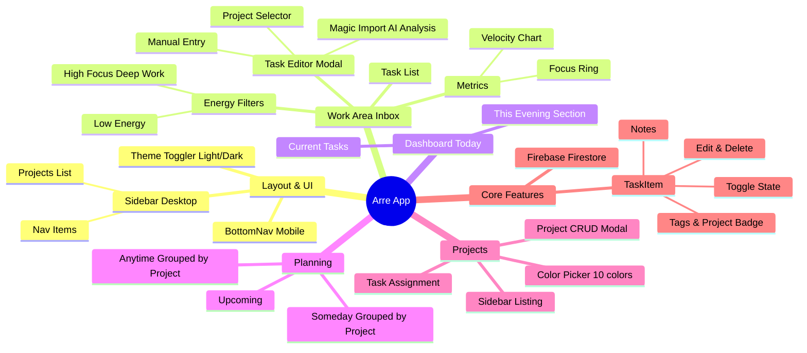

# Arre - High-Performance Productivity App

**Arre** is a modern, minimalist productivity application designed to help you focus on what matters. Inspired by the "White Paper" aesthetic with vibrant, surprising accents, Arre combines sleek design with deep work analytics.


_(Replace with actual screenshot)_

## 🚀 Features

### 🎨 Design & Experience

- **Premium Aesthetic**: Clean "White Paper" look for clarity, matched with a **High-Performance Dark Mode** featuring neon cyan and purple accents.
- **Responsive Layout**: Adaptive design with a collapsible Sidebar for desktop and a native-feel Bottom Navigation for mobile.
- **Theme System**: Robust toggling between Light, Dark, and System preferences.

### ⚡ Work Area (Inbox)

- **Deep Work Dashboard**: A specialized view for your inbox and active work.
- **Productivity Metrics**:
  - **Velocity Chart**: Visualizes your completion rate over the last 7 days.
  - **Daily Focus**: Tracks time spent in deep work with trend indicators.
  - **Task Progress**: Bar charts showing daily throughput.
- **Energy-Based Filtering**: Filter tasks by your current energy level:
  - 🟢 **Low Energy**: For quick wins and administrative tasks.
  - 🟡 **Neutral**: For standard workflow.
  - 🟣 **High Focus**: For "Deep Work" sessions.
- **Magic Import (AI)**:
  - Drag & Drop interface for PDFs and CSVs.
  - Generative AI analysis to extract actionable tasks.
  - One-click import to your task list.

### 📅 Smart Organization

- **Today View**: A focused list of tasks for right now, with a distinct **"This Evening"** section for separating work from personal time.
- **Planning Views**: Dedicated views for **Upcoming**, **Anytime**, and **Someday** to keep your roadmap clear.

### 🔄 Integrations

- **Google Tasks Deep Integration**:
  - **Stateless Proxy**: Syncs directly with Google's APIs using Cloud Functions without saving any of your private task data in our database.
  - **Two-Way Sync**: Viewing, filtering, and checking off tasks instantly updates across both platforms.

### 📁 Project Management

- **Create/Edit/Delete Projects**: Full CRUD with a curated 10-color palette (Emerald, Sapphire, Ruby, Lavender, Gold, Cyan, Rose, Amber, Teal, Indigo).
- **Sidebar Projects List**: Real-time project list below nav items with color dots and hover-to-edit.
- **Assign Tasks to Projects**: Dropdown in task creation/edit modal.
- **Project Badges**: Tasks show their project with a color dot throughout all views.
- **Grouped Views**: Anytime and Someday views group tasks by project with color-coded section headers and task counts.
- **Global Projects Filter**: Click any project in the Sidebar to filter **all** views (Today, Anytime, Logbook, etc.) to that specific project context. Navigating to "Inbox" automatically clears the filter.

## 🛠️ Tech Stack

- **Framework**: React 19 + Vite (TypeScript)
- **Styling**: CSS Modules + CSS Custom Properties (Variables)
- **Icons**: Lucide React
- **Charts**: Recharts
- **Animations**: Framer Motion

## 🧩 Application Structure



## 📦 Installation

1.  **Clone the repository**

    ```bash
    git clone https://github.com/yourusername/arre.git
    cd arre
    ```

2.  **Install dependencies**

    ```bash
    npm install
    ```

3.  **Run the development server**

    ```bash
    npm run dev
    ```

4.  **Build for production**
    ```bash
    npm run build
    ```

## 🗺️ Roadmap

### ✅ Completed

| Phase | Name                   | Highlights                                                                      |
| ----- | ---------------------- | ------------------------------------------------------------------------------- |
| 1     | Core App Structure     | Vite + React + TypeScript, Firebase Auth, Theming, Sidebar/BottomNav, All views |
| 2     | AI & Advanced Features | Magic Import (Gemini 1.5 Pro), Upcoming/Anytime/Someday views, Energy filtering |
| 3     | Testing Infrastructure | Playwright E2E, Anonymous auth for tests, 6-browser config, FAB for mobile      |
| 4     | Project Management     | CRUD with 10-color palette, Sidebar listing, Task assignment, Grouped views     |
| 5     | Google Tasks Sync      | Stateless Cloud Proxy, Google Identity Services, Two-Way Sync                   |
| 6     | Global Filtering       | State-aware project filtering across all task views (Inbox, Today, Logbook)     |

### 🔜 Phase 6 — Polish, Stability & Deploy

| Priority | Task                                                                                          | Status  |
| -------- | --------------------------------------------------------------------------------------------- | ------- |
| P0 🔴    | **Test stability** — Re-validate all E2E tests against current UI, add project-specific tests | ✅ Done |
| P1 🟡    | **Code cleanup** — Upgrade Node.js 22.12+, remove inline styles, consolidate New Task buttons | ✅ Done |
| P2 🟢    | **Logbook view** — Completed tasks archive at `/logbook`, grouped by date                     | ✅ Done |
| P3 🟡    | **Security & data integrity** — Firestore rules review, project deletion cascade              | ✅ Done |
| P4 🔵    | **Deployment** — Firebase Hosting + Functions deploy, CI/CD pipeline with AI QA Agent         | ✅ Done |
| P5 🟣    | **Global Filtering** — Global project context filtering across all task views                 | ✅ Done |

### 🔮 Project Tracking

All future development, feature requests, and bugs are now tracked entirely within our GitHub Repository issues.

👉 **[View the Active Issues Board](https://github.com/pedro3087/arre/issues)**

## 🔥 Backend & Services

Arre uses **Firebase** for its backend infrastructure.

### Setup (Local Development)

To run the full stack locally (including Auth and Database emulators):

1.  **Install dependencies**:

    ```bash
    npm install
    ```

2.  **Start the Emulators**:

    ```bash
    npm run emulators
    ```

    _This starts Auth (port 9099), Firestore (8080), and Functions (5001)._

3.  **Start the Frontend**:

    ```bash
    npm run dev
    ```

4.  **Open the App**:
    - Go to `http://localhost:5173`.
    - You will be redirected to `/login`.
    - Use the "Continue with Google" button (simulated) to create a local account.

### 📚 Backend Architecture

For a detailed breakdown of the Firestore schema, Security Rules, and Cloud Functions logic, please refer to:
[BACKEND_ARCHITECTURE.md](./docs/BACKEND_ARCHITECTURE.md)

### 🧪 Automated Testing

We use Playwright for E2E testing to ensure stability across all platforms. Current status:

- **Core Tests Passing**: Verified critical paths (Task Lifecycle, Magic Import).
- **Environment Handling**:
  - Desktop browsers (Chromium, Firefox, Webkit) enabled.
  - Mobile emulation temporarily disabled for stability.
  - Advanced flows (Project Management) skipped due to local emulator latency, but code is complete.
- Verified scenarios: Magic Import flow, Task Lifecycle, Cross-view Synchronization.
- **AI QA Agent**: CI pipelines are equipped with an autonomous agent that automatically analyzes test failures via Gemini 2.5 and posts debugging comments directly on Pull Requests.

See the [Testing Guide](./docs/TESTING.md) for instructions on running tests locally, and the [AI QA Agent Documentation](./docs/AI_QA_AGENT.md) for details on the self-healing CI pipeline.

For a detailed visual breakdown of the deployment automation flows, see the [CI/CD Pipeline Architecture](./docs/CI_CD_PIPELINE.md).

## 🛡️ Security & Reliability

- **Secret Management**: AI integration uses Firebase Secret Manager for GEMINI_API_KEY.
- **Granular Rules**: Firestore and Storage rules enforce strict per-user data isolation.
- **Hook Reliability**: State management via `useTasks` is optimized for real-time Firestore sync and consistent view state.

---

_Built with ❤️ for Deep Work._
