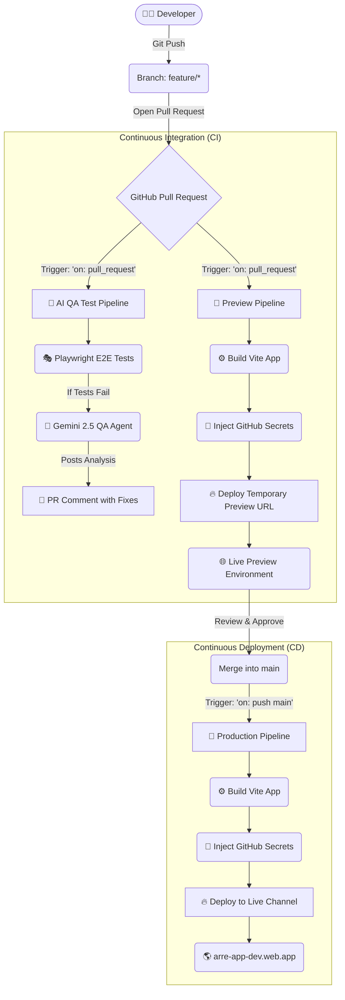

# Arre App: CI/CD Pipeline Architecture

This document outlines the Continuous Integration and Continuous Deployment (CI/CD) strategy for the Arre application, powered by GitHub Actions and Firebase Hosting.

## Overview Diagram

## Workflows Explained

### 1. AI QA Agent Pipeline (`qa-agent.yml`)

- **Trigger**: Opening or updating a Pull Request.
- **Action**: Runs the full suite of Playwright End-to-End tests against a built version of the app using local Firebase Emulators.
- **AI Integration**: If a test fails, the error logs, trace data, and Git diff are sent to a Gemini 2.5 model. The model analyzes the root cause and posts a detailed debugging comment directly on the Pull Request.

### 2. PR Preview Environments (`firebase-hosting-pull-request.yml`)

- **Trigger**: Opening or updating a Pull Request.
- **Action**: Compiles the application, pulling necessary Firebase environment variables from GitHub Repository Secrets securely.
- **Deployment**: Uses Firebase Hosting to create a temporary "Preview Channel" (e.g., `arre-app-dev--pr-123.web.app`). This link is uniquely generated for the PR and expires automatically in 6 hours.
- **Benefit**: Allows developers and stakeholders to visually test the exact changes in a live environment before deciding to merge.

### 3. Production Deployment (`firebase-hosting-merge.yml`)

- **Trigger**: Merging code into the `main` branch.
- **Action**: Runs a clean production build of the Vite application with strict environment variables.
- **Deployment**: Deploys securely to the Firebase Hosting `live` channel (`arre-app-dev.web.app`).
- **Rollback**: Firebase retains deployment history, meaning if a bad merge occurs, rolling back to the previous stable version is a single click in the Firebase Console.

## Environment & Security

The build process strictly relies on GitHub Secrets to securely populate the `import.meta.env` variables required for the Firebase SDK initialization. This enforces strict "12-Factor App" methodology and prevents plaintext API keys from being leaked in the Git repository's source code. We use the `FIREBASE_SERVICE_ACCOUNT` mechanism for zero-trust deployment authentication.
