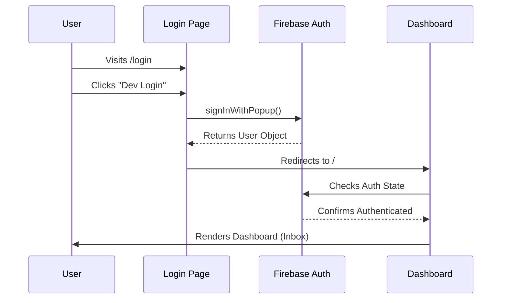
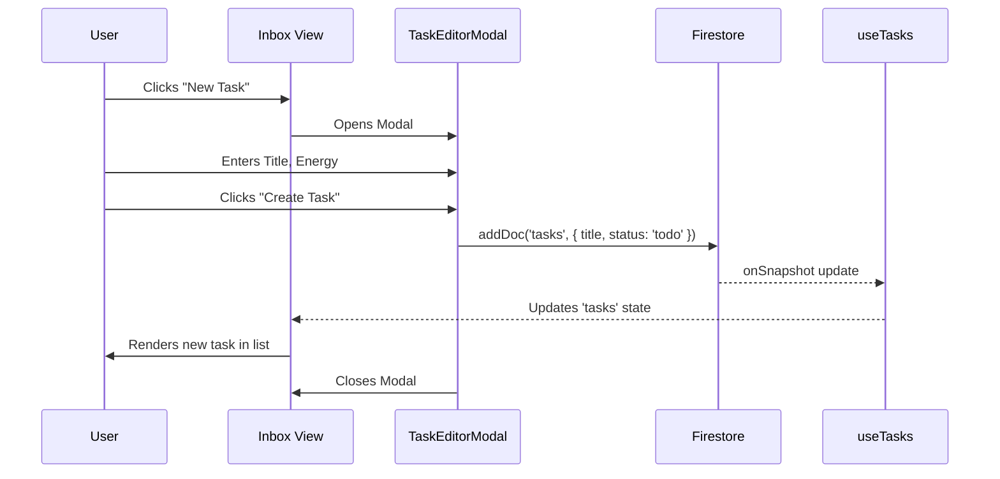
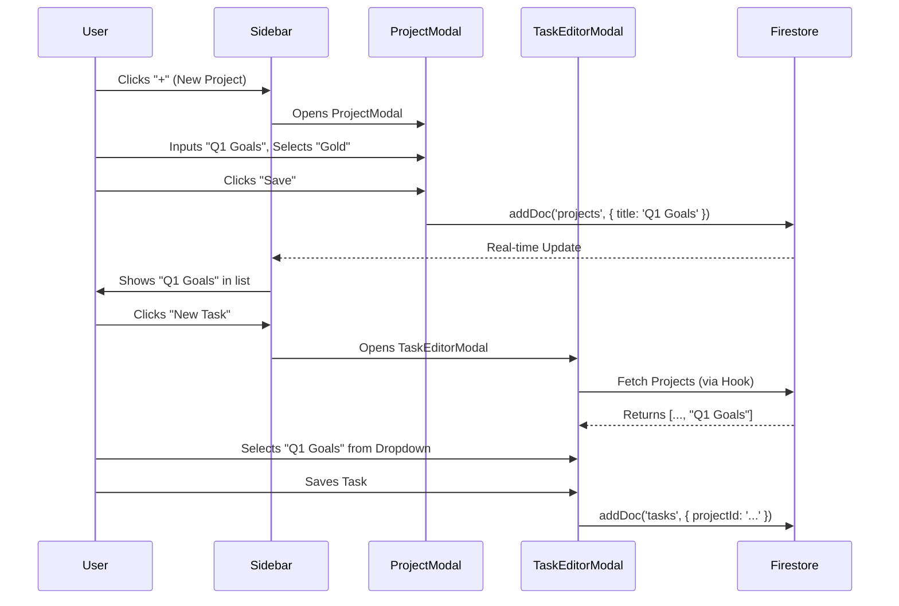

# Test Scenarios Inventory (BDD)

This document outlines the comprehensive test scenarios for the Arre application using Behavior-Driven Development (BDD) syntax (Given/When/Then). These scenarios serve as the source of truth for both manual QA and automated test coverage.

## 🟢 Feature: Authentication

### Scenario: User Login (Development Mode)

- **Given** the user is on the Login page (`/login`)
- **When** the user clicks the "Dev Login" button
- **Then** the user is authenticated successfully
- **And** the user is redirected to the root URL (Dashboard)

---

## 🟢 Feature: Task Management

### Scenario: Create a Manual Task

- **Given** the user is logged in and on the **Inbox** page
- **When** the user clicks the "New Task" button (Header or FAB)
- **And** the "New Task" (Manual) tab is active by default
- **And** the user enters a unique task title (e.g., "Review Q3 Report")
- **And** the user selects an energy level (e.g., "High")
- **And** the user clicks "Create Task"
- **Then** the modal closes
- **And** the new task "Review Q3 Report" appears visible in the task list

### Scenario: Magic Import UI Verification

- **Given** the user opens the "New Task" modal
- **When** the user switches to the "Magic Import" tab
- **Then** the file drop zone is visible with text "Drop PDF or CSV here"

### Scenario: Complete a Task

- **Given** a task "Buy Milk" exists in the Inbox with status `todo`
- **When** the user clicks the checkbox next to "Buy Milk"
- **Then** the task disappears from the active list (or status updates to `completed`)
- **And** the velocity chart metrics update (if visible)

### Scenario: Edit a Task (Title/Notes)

- **Given** a task "Buy Milk" exists
- **When** the user clicks the "Edit" button on the task row
- **And** the user updates the title to "Buy Almond Milk"
- **And** the user clicks "Save"
- **Then** the task in the list updates to show "Buy Almond Milk"

### Scenario: Delete a Task

- **Given** a task exists
- **When** the user clicks the "Delete" button on the task row
- **And** the user confirms the browser dialog
- **Then** the task is permanently removed from the list

### Scenario: Drag and Drop Reordering

- **Given** multiple tasks within the same project group in Anytime view
- **When** the user drags a task "A" above task "B"
- **Then** the list instantly reorders with a smooth animation
- **And** the new order is persisted to the backend
- **And** the order remains consistent after a page reload

---

## 🟢 Feature: Project Management

### Scenario: Create a New Project

- **Given** the user is on any main view
- **When** the user clicks the "New Project" (+) button in the Sidebar
- **And** the user enters a project name (e.g., "Work Project")
- **And** the user selects a color (e.g., "Sapphire")
- **And** the user clicks "Save Project"
- **Then** "Work Project" appears in the Sidebar project list with a blue dot

### Scenario: Assign Task to Project

- **Given** a project "Work Project" exists
- **And** the user is creating a new task "Prepare slide deck"
- **When** the user selects "Work Project" from the project dropdown
- **And** the user creates the task
- **Then** the task "Prepare slide deck" appears in the Inbox with a "Work Project" badge

### Scenario: Grouping by Project in Planning Views

- **Given** multiple tasks assigned to "Work Project"
- **And** the user navigates to the **Anytime** view
- **Then** the tasks are displayed under a "Work Project" section header
- **And** unassigned tasks are displayed under a "Single Actions" section

### Scenario: Delete a Project

- **Given** a project "Old Project" exists
- **When** the user edits the project and clicks "Delete"
- **And** the user confirms the deletion
- **Then** the project is removed from the Sidebar
- **And** tasks assigned to it become unassigned (or are deleted, depending on cascade logic)

### Scenario: Global Project Filtering

- **Given** projects "Work" and "Personal" exist
- **And** tasks exist in both projects
- **When** the user clicks "Work" in the Sidebar
- **Then** all views (Inbox, Anytime, Logbook) only show tasks from "Work"
- **And** the "Work" project item in Sidebar shows an active highlight
- **And** the view header shows a "• Filtered" indicator
- **When** the user clicks "Work" again or clicks "Inbox"
- **Then** the filter is cleared
- **And** all tasks are visible again

---

## 🟢 Feature: Views & Navigation

### Scenario: View Navigation (Desktop)

- **Given** the user is on the Dashboard
- **When** the user clicks "Upcoming" in the Sidebar
- **Then** the URL changes to `/upcoming`
- **And** the Upcoming view component loads
- **When** the user clicks "Someday" in the Sidebar
- **Then** the URL changes to `/someday`
- **And** the Someday view loads

### Scenario: Mobile Layout Adaptation

- **Given** the viewport width is mobile size (<768px)
- **Then** the Sidebar is hidden
- **And** the Bottom Navigation bar is visible
- **And** the "New Task" FAB (Floating Action Button) is visible at the bottom right

### Scenario: Theme Switching

- **Given** the user is on the app
- **When** the user clicks the Theme Toggle button (Sun/Moon/System)
- **Then** the application background and text colors update to match the selected theme (Light/Dark)

---

## 🔴 Feature: Edge Cases & Validation (Future/Pending Tests)

### Scenario: Offline Behavior (Firestore)

- **Given** the network is disconnected
- **When** the user creates a task
- **Then** the task appears optimistically in the UI
- **And** syncs to the backend once functionality is restored

### Scenario: Empty States

- **Given** the user has no tasks
- **When** the user views the Inbox
- **Then** a "No tasks" empty state message is displayed

---

## 📊 Feature Visualizations (Sequence Diagrams)

### 1. Authentication Flow

### 2. Task Creation Flow (Manual)

### 3. Project Creation & Assignment

