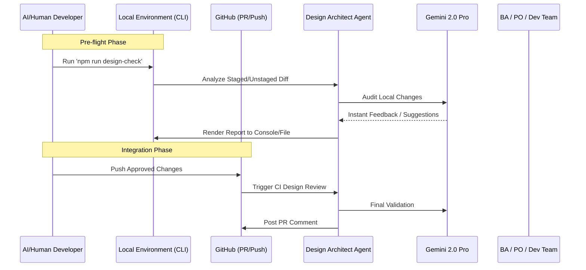

# Feature Specification: Design Architect Agent (UX/UI Critic)

**Feature Path**: `specs/004-design-architect-agent`
**Created**: 2026-03-08
**Status**: Specification

## 1. Overview

The **Design Architect Agent** is an autonomous AI assistant specialized in UX/UI analysis, visual consistency, and front-end excellence. Unlike the QA Agent (which focuses on functional correctness), the Design Architect focuses on the "look and feel," alignment, and user journey of Arre.

It provides an expert "second pair of eyes" to ensure that as features scale, the application maintains its premium "White Paper" aesthetic and high-performance dark mode consistency.

## 2. System Architecture & Workflow

### Integrations Required

- **GitHub API**: For metadata, file extraction, and commenting on PRs.
- **Gemini 2.0 Pro**: Primary reasoning engine for visual heuristics and UX analysis.
- **Project Context**: Access to `docs/FRONTEND_LAYER.md` and `src/styles/variables.css` as "Ground Truth".
- **(Future) Playwright VRT**: Potential integration for Visual Regression Testing snapshots.

## 3. Agent Persona & Skills

### Persona

A senior Product Designer and Frontend Architect with an obsessive eye for detail, accessibility (a11y), and consistent design languages (like Apple's HIG or Material Design 3), but specifically tailored to the **Arre Design System**.

### Core Skills

- **Visual Auditing**: Analyzing alignment, padding, margins, and whitespace.
- **Color & Typography Review**: Ensuring adherence to `variables.css` and proper hierarchy.
- **UX Journey Mapping**: identifying friction points in forms (like TaskEditorModal) or navigation.
- **Component Consistency**: Ensuring buttons, inputs, and windows look and behave identical across different views.
- **UI Security Analysis**: Identifying areas where UI might trick users or expose sensitive patterns (e.g., hidden states).

## 3. Requirements & Workflows

### W-001: Local Pre-flight Check

Developers run the agent locally before committing to catch alignment or token errors early.

- **Input**: Local uncommitted changes (`git diff`).
- **Output**: Fast-feedback report in terminal (target: <60 seconds).
- **Failure Mode**: If Gemini is unavailable, log a warning and exit gracefully (non-blocking).

### W-002: Automated PR Review

Triggered on **pull request open or update** (push to a branch with an open PR). Runs a final audit to ensure no design regressions were introduced.

- **Input**: Git diff between the feature branch and the base branch.
- **Output**: A "Design Review Report" posted as a comment on the PR.
- **Failure Mode**: If Gemini is unavailable, CI step passes with a warning comment on the PR noting the audit was skipped.

### W-003: Alignment & Consistency Check

Verification that new components utilize established tokens instead of ad-hoc styles.

### W-004: "Design Debt" Stories

The agent identifies "Polish" items and suggests them as new stories for the PO.

## 4. Integration Logic

Similar to the `qa-agent.js`, we will implement a `design-architect.js` script that:

1.  Filters the diff to **frontend-only files**: `*.tsx`, `*.ts` (React components), `*.module.css`, `*.css`.
2.  Uses the LLM (Gemini 2.5 Flash) to "look" at the CSS Modules and React components.
3.  Maps changes against the `docs/FRONTEND_LAYER.md` policy.
4.  Generates a markdown report structured into severity sections: **Critical** (blocks merge), **Warning** (should fix), **Suggestion** (nice to have) — each finding includes a file reference and description.

## Clarifications

### Session 2026-03-08

- Q: Which files should the agent analyze from the diff? → A: Frontend-only files: `*.tsx`, `*.ts` (components), `*.module.css`, `*.css`
- Q: What structure should the Design Review Report follow? → A: Structured sections with severity labels (Critical / Warning / Suggestion), each with file reference and description
- Q: What happens when the Gemini API is unavailable? → A: Non-blocking — log a warning, skip the audit, allow commit/CI to pass
- Q: What is the latency target for W-001 local pre-flight check? → A: Under 60 seconds
- Q: When does W-002 CI trigger? → A: Only on pull request open/update (push to branch with open PR)

## 5. Success Criteria

- **SC-001**: 0% usage of hardcoded HEX colors outside of `variables.css`.
- **SC-002**: Every PR is audited for responsive alignment (Mobile vs Desktop).
- **SC-003**: The agent identifies at least one "low-alignment" or "UX friction" point per major feature.
