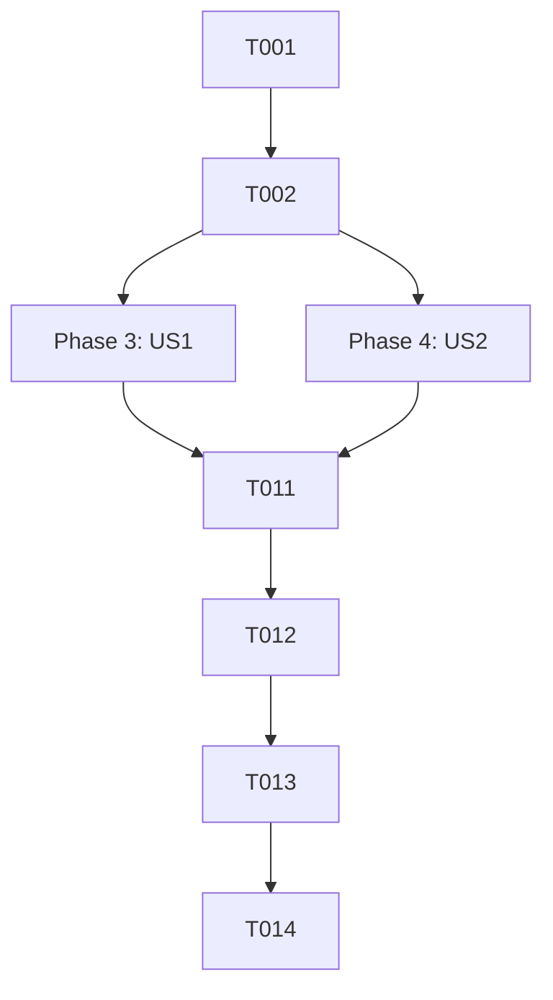

# Task List: Settings Page UI Alignment

**Feature Branch**: `026-settings-page-alignment`  
**Created**: 2026-03-09
**Status**: Draft  
**Input**: User request for settings page UI alignment similar to New Task modal.

## Phase 1: Setup

- [x] T001 Verify branch `026-settings-page-alignment` is clean and up-to-date with `main`
- [x] T002 [P] Review `src/styles/variables.css` for existing radius and neon color tokens

## Phase 3: [US1] Settings Appearance Alignment

**Goal**: Update theme selector to use pill-shaped options and consistent active states.
**Independent Test**: Navigate to Settings and verify theme buttons are fully rounded.

- [x] T003 [US1] Update `.themeSelector` in `src/pages/Settings.module.css` to use `border-radius: 9999px`
- [x] T004 [US1] Update `.themeOption` in `src/pages/Settings.module.css` to use `border-radius: 9999px`
- [x] T005 [US1] Add glow effect to `.themeOptionActive` in `src/pages/Settings.module.css` to match `EnergyFilter`

## Phase 4: [US2] Integrations & Action Buttons Alignment

**Goal**: Update integration cards and buttons to match the "White Paper" and pill-shaped aesthetics.
**Independent Test**: Compare "Connect" button in Settings with "Create Task" in modal.

- [x] T006 [US2] Update `.integrationCard` in `src/pages/Settings.module.css` to use `border-radius: 24px`
- [x] T007 [US2] Update `.connectButton` in `src/pages/Settings.module.css` to use `border-radius: 9999px` and `var(--accent-purple-neon)`
- [x] T008 [US2] Update `.disconnectButton` in `src/pages/Settings.module.css` to use `border-radius: 9999px`
- [x] T009 [US2] Update `.taskListItem` in `src/pages/Settings.module.css` to use `border-radius: 16px`
- [x] T010 [US2] Update `.checkboxLabel input[type="checkbox"]` in `src/pages/Settings.module.css` to use `border-radius: var(--radius-md)`

## Phase 5: Polish & Cross-Cutting Concerns

- [x] T011 Verify responsiveness of the integration card on mobile devices in `src/pages/Settings.module.css`
- [x] T012 Run a final visual audit of the Settings page using `npm run dev`
- [x] T013 Update `docs/DESIGN_VIBES.md` if any new standardized radii or styles were established
- [x] T014 Merge `026-settings-page-alignment` into `main` after verification

## Dependency Graph

## Parallel Execution Examples

- **US1 & US2 Integration**: CSS updates for US1 (T003-T005) and US2 (T006-T010) are mostly separate blocks in the same file and can be developed back-to-back.

## Implementation Strategy

- **MVP**: Complete User Story 1 (Theme Selector) first as it is the most visible "pill" alignment.
- **Incremental**: Follow with User Story 2 to complete the brand alignment for the primary integration action.
